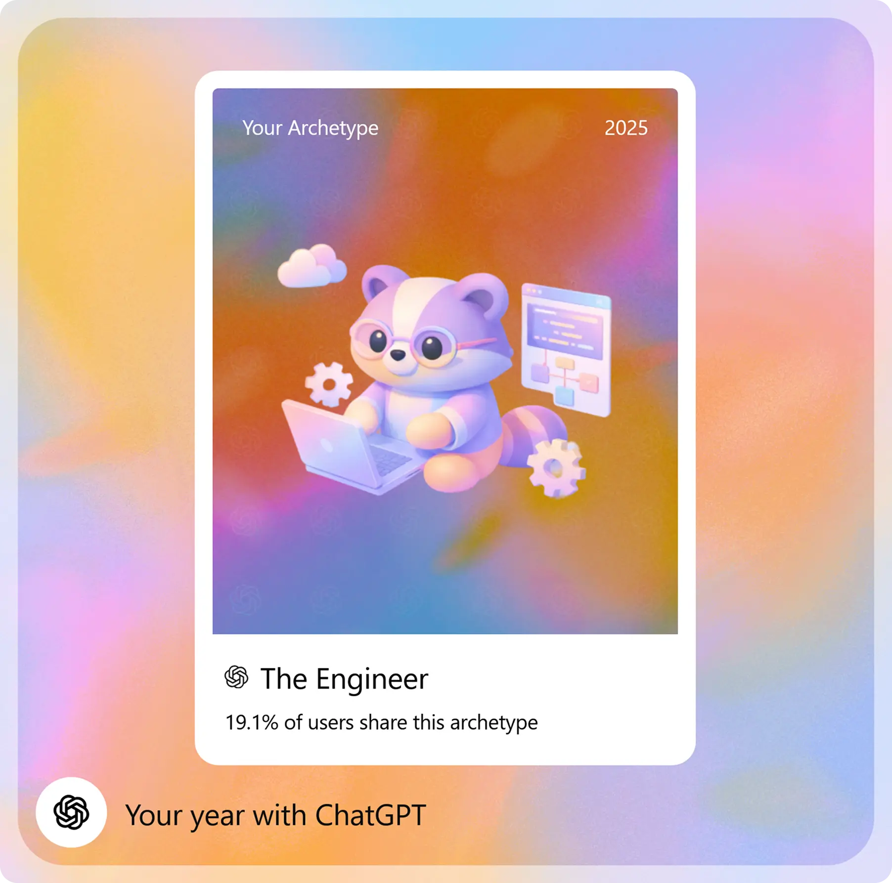

<h3>Hey there! <h3/>

<h4>I'm Anurag, a software engineer based in India.</h4>

 

I enjoy understanding how things work before building them. Loves to question <strong>why</strong> before arriving at <strong>how</strong>
   which helps me in unbounded thinking.

   
 

Solving problems is my gig, whether solving coding challenges in contests or solving real world problems. Having a engineering mindset let's me understand
   the <strong>trade-offs</strong> of my approach / solution to that problem.

 
&nbsp;&nbsp;&nbsp;&nbsp;- I value simple, intentional design over unnecessary complexity, basically a minimalist. 
&nbsp;&nbsp;&nbsp;&nbsp;- I believe good engineering comes from thoughtful design, not unnecessary complexity. 
&nbsp;&nbsp;&nbsp;&nbsp;- Most of my time is spent learning, building, and solving problems.
 
 
 
 

   
   &nbsp;&nbsp;&nbsp;&nbsp;&nbsp;&nbsp;&nbsp;&nbsp;
   

